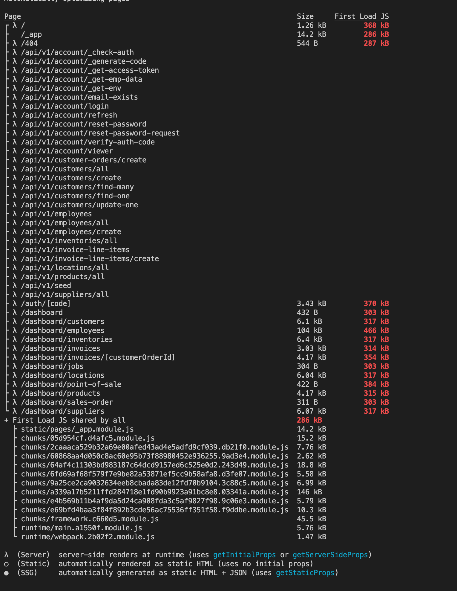
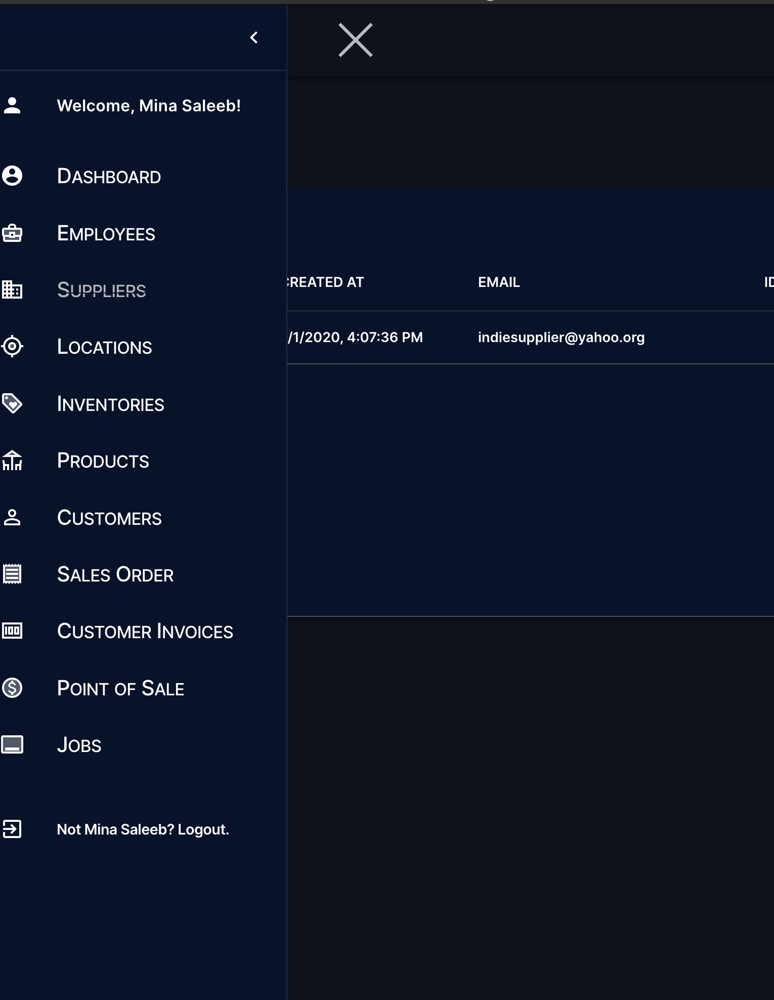
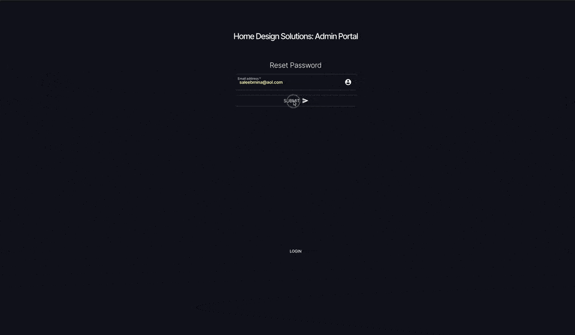

## Demonstration

### Screenshots

#### Production build stats



#### Side menu



### Kaps (gifs)

#### Login & reset password demonstration



#### POS view

Creating a customer, or selecting a customer


#### Customer order

Adding products to the order, then submitting the order.


## How to Initialize

---

- generate keys for encryption as stated below for the seed data and prisma authentication
  - `cd keys`
  - `openssl req -newkey rsa:2048 -new -nodes -x509 -days 3650 -keyout key.pem -out cert.pem`
  - `openssl rsa -in key.pem -pubout -out pubkey.pem`
  - `chmod 400 key.pem cert.pem pubkey.pem`
- make sure .env has correct mysql_url for prisma in the prisma folder.
- fill .env secrets in root dir, see [.env.example](./.env.example)
- create user hds_user and database hds.
  - `create database hds;`
  - `create user hds_user@localhost identified by 'peaceBWithYou123!';`
  - `grant all privileges on hds.* to hds_user@localhost;`
- finally run `npm run prisma2:init` to have prisma generate database schema
- to seed the test data (see [seed file and dummy data](./pages/api/v1/seed.ts))
  - Use Postman, or any REST interface, to send a request to the host endpoint at `/api/v1/seed` with a query variable `seed_secret` set to the corresponding env variable, SEED_SECRET.

## Deploy to server

---

Included in this repo - nginx configs, .zshrc file. The nginx configs include one for a static site, the "branch.codes" one (used for an angular front end website for hds), then the "admin.branch.codes" nginx config which reverse proxies the node process.

### Git

Shell scripts - so this part will initialize the basics, a gpg and ssh key, software updates

Depending on if you use GCP or AWS, or DO, etc. the user password may not be enough security if you get ultra paranoid like me. So look up some things (primarily about teh sshd_config, /etc/sudoers.d/\*\*, mysql config and restricting access). I probably did not include them here.

```shell script
#!/bin/sh
sudo apt update && sudo apt upgrade -y
sudo apt install software-properties-common zsh gnupg2 curl
print "=> Change your password!!"
sudo passwd "$USER"
print "=> creating gpg key"
gpg --full-generate-key
gpg --list-secret-keys --keyid-format LONG
printf "=> please copy the long string aka the id of the gpg key"
read -r keyid
gpg --armor --export "$keyid"
printf '=> Have you copied it and added it to Git?? [y/N] '
read -r confirmation_gpg
echo "$confirmation_gpg"

ssh-keygen -t ecdsa -b 521 -f ~/.ssh/id_ecdsa_521
cat ~/.ssh/id_ecdsa_521.pub
```

### mysql

Also, perhaps you will need to install mysql. [make sure it is the latest version](https://dev.mysql.com/downloads/repo/apt/)

```shell script
curl --http2 --tlsv1.2 https://repo.mysql.com//mysql-apt-config_0.8.15-1_all.deb -o ~/Downloads/mysql.deb
sudo dpkg -i ./mysql.deb
sudo apt update
sudo apt install mysql-server
sudo systemctl enable mysql && sudo systemctl start mysql
sudo mysql_secure_installation
# follow instructions... click ok
```

### nginx

nginx, if not using bionic awk it out from this snippet:

follow up to date info here:

http://nginx.org/en/linux_packages.html#Ubuntu

Now reboot.

```shell script
sudo reboot
```

I like to have my server automatically reboot every night so add a cron-job for this

```shell script
sudo crontab -e

#todo yourself -
# add something like this
4 20 * * * /sbin/shutdown -r +5
```

### for swap space

```shell script
sudo swapon --show
sudo fallocate -l 1G /swapfile
sudo dd if=/dev/zero of=/swapfile bs=1024 count=1048576
sudo chmod 600 /swapfile
sudo mkswap /swapfile
echo '/swapfile swap swap defaults 0 0' | sudo tee -a /etc/fstab
sudo sysctl vm.swappiness=10
```

### auto updates

```shell script
sudo dpkg-reconfigure --priority=low unattended-upgrades
```

### node, pm2

#### nvm

if you added the oh my zsh plugins above, and added nvm to the zshrc, then you can use the following nvm commands

```shell script
nvm install stable
nvm alias default stable
npm -g install pm2

pm2 completion >>~/.zshrc
```

### pm2 production

when ready to deploy persistently, set up the [ecosystem](https://pm2.keymetrics.io/docs/usage/application-declaration/) file and perhaps even sign up for the pm2 plus. [its super cool](https://pm2.io/docs/plus/overview/#features-available-in-pm2-plus).

```shell script
pm2 autostart
pm2 run ecosystem.config.js
pm2 save
```

# ~~TODO~~

---

## admin console

1. ~~Forms: login / register / reset password~~

2. ~~setting up all the tables~~

3. POS
   - ~~finish customer order products display.~~
   - ~~seal the deal with redux action, i.e. put customer order in db async~~
     1. ~~will have to deduct quantity picked from each CustomerOrderProduct off the Product's inventory location quantity~~
   - show the customer orders as invoices
     1. ~~create base invoice on server side if not created already~~
     2. ~~line items - bill to pay,~~ deduct the amount from invoice total as added.

## Unit tests

1. just get started. no excuses dude. - did not do any unit tests...

## General refactoring

1. It would be wise to refactor these aspects of this application before considering it ready for production:

   - Redux store states do not accommodate for transient states.
     1. for example, customer order state should handle the states of the order, i.e. attempt add product, add product success, add product fail.
     2. I wonder if it would make sense to submit the order partially in steps to the server concurrently, and handle the canceled order by time out or allow the store location to resume previous orders.
   - Refine data fetching methods, ie remove axios dependency and stick to fetch.
   - Reduce redundant instantiations of prisma client from the api routes and server side requests into single utility
   - API routes checking for auth redundancy as well as verifying request params / method

2. Database structure + documentation

   - a lot of crap in the database makes no sense without a documentation of the underlying structure and planning that went into it, i.e. "Jobs" - "Invoice" relationship
   - it would help to at least comment the info into the schema file for prisma

3. I did absolutely zero seo, not to mention even the basics like page title and unique meta.

## issues

1. Static generation cuts off server side authentication in GIP here: [withRedux](./lib/hoc/with-redux.tsx)

   - current GIP depends on server req to reroute properly with auth state
   - implications right now include no static generation for dashboard pages without refactoring
   - instigates possible issues down the road with following separation of concerns
   - optionally move it to the client side, and use router to reroute

## personal learning interests

1. How to implement a listener or subscriber to state properly with the redux pattern or by any other means albeit effective, or experimental :)
2. How to have server handle tokens so that the cookies stored on a secure domain have httpOnly and secure flags
